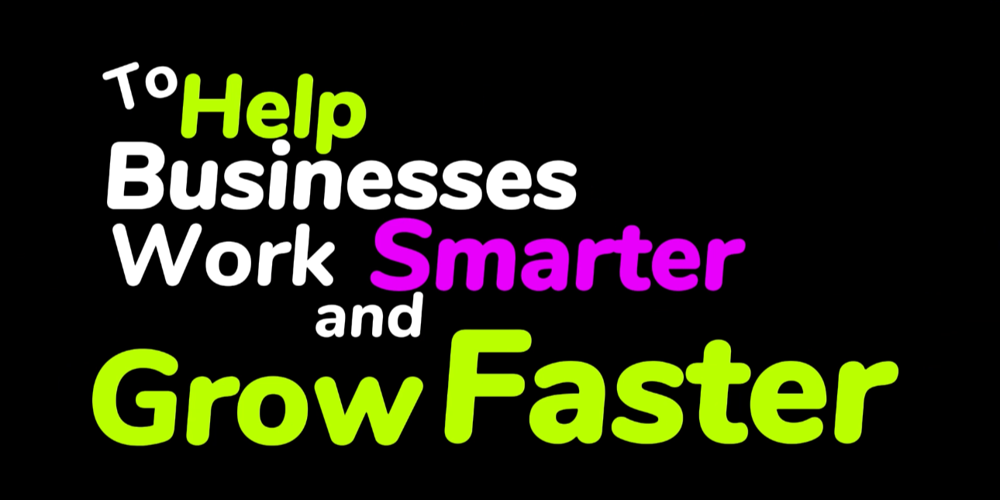

# Wordify Video Lab

Small browser app for building kinetic typography videos from a short script.

## What it does

- Breaks text into random one-to-four-word chunks
- Builds those chunks into timed scenes on a video timeline
- Places chunks in different positions with slight rotation
- Animates each chunk with zoom in and zoom out motion while keeping it alive until the scene changes
- Lets you select clips, edit text, change alignment, recolor, resize, and drag them on the canvas
- Uses collision-aware layout so clips in the same scene avoid overlapping
- Includes local AI-assist actions for smart alignment, scene balancing, and re-arranging the layout
- Supports uploaded voice-over audio for preview, scrubbing, and browser-native export when capture is supported
- Exports the composed timeline as a `.webm` video using `MediaRecorder`

## Run

Open `index.html` in a modern browser, or serve the folder with any static file server if your browser is strict about local file permissions.

## Notes

- Preview and export use the same canvas renderer
- Export format is `WebM` because that is the most practical browser-native option without adding a video encoding backend
- Voice-over export depends on browser support for media capture from an audio element; if unsupported, export falls back to video-only
